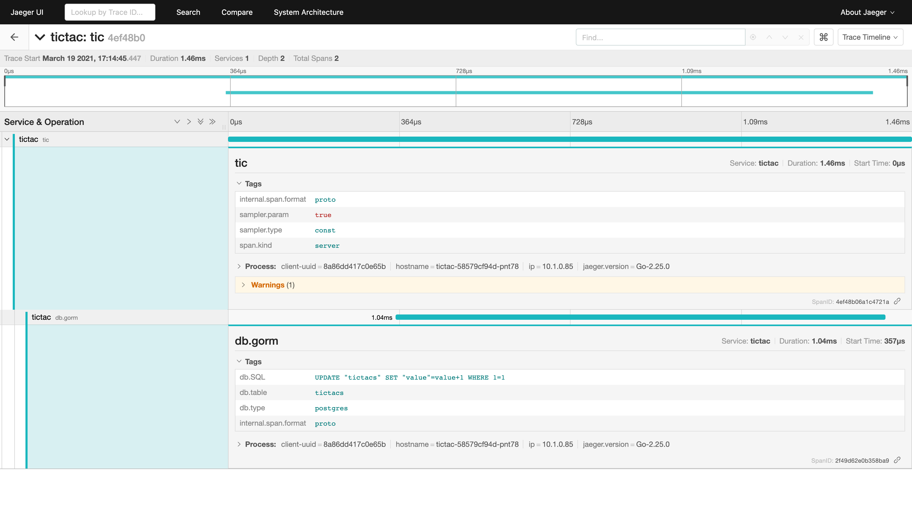

# gokit microservice demo

[](https://github.com/cage1016/ms-demo/actions/workflows/test.yml)
[](https://github.com/cage1016/ms-demo/actions/workflows/build.yml)

| Service | Description           |
| ------- | --------------------- |
| add     | Expose Sum method     |
| tictac  | Expose Tic/Tac method |

## Features

- **[Kubernetes](https://kubernetes.io)/[GKE](https://cloud.google.com/kubernetes-engine/):**
  The app is designed to run on Kubernetes (both locally on "Docker for
  Desktop", as well as on the cloud with GKE).
- **[gRPC](https://grpc.io):** Microservices use a high volume of gRPC calls to
  communicate to each other.
- **[Istio](https://istio.io):** Application works on Istio service mesh.
- **[Skaffold](https://skaffold.dev):** Application
  is deployed to Kubernetes with a single command using Skaffold.
- **[go-kit/kit](https://github.com/go-kit/kit):** Go kit is a programming toolkit for building microservices (or elegant monoliths) in Go. We solve common problems in distributed systems and application architecture so you can focus on delivering business value.
- **[kubernetes/ingress-nginx](https://github.com/kubernetes/ingress-nginx/)**: ingress-nginx is an Ingress controller for Kubernetes using NGINX as a reverse proxy and load balancer
- **[Jaeger](https://www.jaegertracing.io/)**: open source, end-to-end distributed tracing. Monitor and troubleshoot transactions in complex distributed systems

## Install

this demo support [Kubernetes service](.#kubernetes-service) or [nginx ingress](.#nginx-ingress) and [Istio](.#istio) three ways to access

### Kubernetes Service

1. Run ms-demo kubernetes cluster
    ```sh
    skaffold run 
    ```

    or 

    ```sh
    kubectl apply -f https://raw.githubusercontent.com/cage1016/ms-demo/master/deployments/k8s-all.yaml
    ```
1. We expose `add`, `tictac` service with TWO external service (LoadBalancer)
2. Set the `ADD_HTTP_EXTERNAL_URL/ADD_GRPC_EXTERNAL_URL`
    ```sh
    ADD_HTTP_EXTERNA_PORT=$(kubectl get service add-external -o jsonpath='{.spec.ports[?(@.name=="http")].port}')
    ADD_GRPC_EXTERNA_PORT=$(kubectl get service add-external -o jsonpath='{.spec.ports[?(@.name=="grpc")].port}')
    ADD_EXTERNA_HOST=$(kubectl get service add-external -o jsonpath='{.status.loadBalancer.ingress[0].hostname}')
    ADD_HTTP_EXTERNA_URL=$ADD_EXTERNA_HOST:$ADD_HTTP_EXTERNA_PORT
    ADD_GRPC_EXTERNA_URL=$ADD_EXTERNA_HOST:$ADD_GRPC_EXTERNA_PORT
    echo $ADD_HTTP_EXTERNA_URL
    echo $ADD_GRPC_EXTERNA_URL
    ```

1. Set the `TICTAC_HTTP_EXTERNAL_URL/TICTAC_GRPC_EXTERNAL_URL`

    ```sh
    TICTAC_HTTP_EXTERNAL_PORT=$(kubectl get service tictac-external -o jsonpath='{.spec.ports[?(@.name=="http")].port}')
    TICTAC_GRPC_EXTERNAL_PORT=$(kubectl get service tictac-external -o jsonpath='{.spec.ports[?(@.name=="grpc")].port}')
    TICTAC_EXTERNAL_HOST=$(kubectl get service tictac-external -o jsonpath='{.status.loadBalancer.ingress[0].hostname}')
    TICTAC_HTTP_EXTERNAL_URL=$TICTAC_EXTERNAL_HOST:$TICTAC_HTTP_EXTERNAL_PORT
    TICTAC_GRPC_EXTERNAL_URL=$TICTAC_EXTERNAL_HOST:$TICTAC_GRPC_EXTERNAL_PORT
    echo $TICTAC_HTTP_EXTERNAL_URL
    echo $TICTAC_GRPC_EXTERNAL_URL
    ```

1. Access by command
   
    **sum** restful method 
    ```sh
    curl -X POST $ADD_HTTP_EXTERNA_URL/sum -d '{"a": 1, "b":1}'
    ```
    
    **sum** grpc mwthod
    ```sh
    grpcurl -d '{"a": 1, "b":1}' -plaintext -proto ./pb/add/add.proto $ADD_GRPC_EXTERNA_URL pb.Add.Sum    
    ```
    
    **tic** restful method
    ```sh
    curl -X POST $TICTAC_HTTP_EXTERNAL_URL/tic
    ```

    **tic** grpc method
    ```sh
    grpcurl -plaintext -proto ./pb/tictac/tictac.proto $TICTAC_GRPC_EXTERNAL_URL pb.Tictac.Tic
    ```
    
    **tac** restful method
    ```sh
    curl $TICTAC_HTTP_EXTERNAL_URL/tac
    ```

    **tac** grpc method
    ```sh  
    grpcurl -plaintext -proto ./pb/tictac/tictac.proto $TICTAC_GRPC_EXTERNAL_URL pb.Tictac.Tac
    ```

### Nginx ingress

1. setup nginx ingress

    ```sh
    kubectl create ns ingress-nginx
    helm install ingress-nginx -n ingress-nginx ingress-nginx/ingress-nginx
    ```

1. Prepre tls for nginx ingress GRPC for two grpc test domain `tictac.localhost` & `add.localhost`
    - create RSA private key and certificate
    ```sh
    sh tls/generate.sh
    ```
    - set ingress tls
    ```sh
    sh tls/tls.sh
    ```

1. Setup nginx ingress 
    ```
    kubectl apply -f https://raw.githubusercontent.com/cage1016/ms-demo/master/deployments/nginx-ingress.yaml
    ```

1. Set up `ADD_NGINX_INGRESS_GRPC_URL` & `TICTAC_NGINX_INGRESS_GRPC_URL`

    ```sh
    ADD_NGINX_INGRESS_GRPC_URL=$(kubectl get ingress add-grpc-ingress -o jsonpath='{.spec.tls[0].hosts[0]}'):443
    TICTAC_NGINX_INGRESS_GRPC_URL=$(kubectl get ingress tictac-grpc-ingress -o jsonpath='{.spec.tls[0].hosts[0]}'):443
    echo ${ADD_NGINX_INGRESS_GRPC_URL}
    echo ${TICTAC_NGINX_INGRESS_GRPC_URL}
    ```

2. Access by command

    **sum** restful method 
    ```sh
    curl --insecure -X POST -d '{"a": 1, "b":1}' https://localhost/api/v1/add/sum
    ```

    **sum** grpc method
    ```sh
    grpcurl --insecure -d '{"a": 1, "b":1 }' ${ADD_NGINX_INGRESS_GRPC_URL}  pb.Add.Sum
    ```
    
    **tic** restful method
    ```sh
    curl --insecure -X POST https://localhost/api/v1/tictac/tic
    ```

    **tic** grpc method
    ```sh
    grpcurl --insecure ${TICTAC_NGINX_INGRESS_GRPC_URL} pb.Tictac.Tic
    ```
    
    **tac** restful method
    ```sh
    curl --insecure https://localhost/api/v1/tictac/tac
    ```

    **tac** grpc method
    ```sh  
    grpcurl --insecure ${TICTAC_NGINX_INGRESS_GRPC_URL} pb.Tictac.Tac
    ```

3. Clean up Nnginx

    ```sh
    kubectl delete -f https://raw.githubusercontent.com/cage1016/ms-demo/master/deployments/nginx-ingress.yaml

    kubectl delete secret add-tls-secret
    kubectl delete secret tictac-tls-secret
    ```
### Istio

1. You should have a Kubernetes cluster with Istio already.
2. Apply Istio manifests

    ```sh
    kubectl apply -f https://raw.githubusercontent.com/cage1016/ms-demo/master/deployments/gateway-all.yaml
    ```
3. Set the `GATEWAY_HTTP_URL/GATEWAY_GRPC_URL` environment variable in your shell to the public IP/port of the Istio Ingress gateway.
    ```sh
    export INGRESS_HTTP_PORT=$(kubectl -n istio-system get service istio-ingressgateway -o jsonpath='{.spec.ports[?(@.name=="http2")].port}')
    export INGRESS_GRPC_PORT=$(kubectl -n istio-system get service istio-ingressgateway -o jsonpath='{.spec.ports[?(@.name=="https")].port}')
    export INGRESS_HOST=$(kubectl -n istio-system get service istio-ingressgateway -o jsonpath='{.status.loadBalancer.ingress[0].hostname}')
    export GATEWAY_HTTP_URL=$INGRESS_HOST:$INGRESS_HTTP_PORT
    export GATEWAY_GRPC_URL=$INGRESS_HOST:$INGRESS_GRPC_PORT
    echo $GATEWAY_HTTP_URL
    echo $GATEWAY_GRPC_URL
    ```
4. Access by command
    **sum** restful method 
    ```sh
    curl -X POST $GATEWAY_HTTP_URL/api/v1/add/sum -d '{"a": 1, "b":1}'
    ```

    **sum** grpc method
    ```sh
    grpcurl -d '{"a": 1, "b":1}' -plaintext -proto ./pb/add/add.proto $GATEWAY_GRPC_URL pb.Add.Sum
    ```
    
    **tic** restful method
    ```sh
    curl -X POST $GATEWAY_HTTP_URL/api/v1/tictac/tic
    ```

    **tic** grpc method
    ```sh
    grpcurl -plaintext -proto ./pb/tictac/tictac.proto $GATEWAY_GRPC_URL pb.Tictac.Tic
    ```
    
    **tac** restful method
    ```sh
    curl $GATEWAY_HTTP_URL/api/v1/tictac/tac
    ```

    **tac** grpc method
    ```sh  
    grpcurl -plaintext -proto ./pb/tictac/tictac.proto $GATEWAY_GRPC_URL pb.Tictac.Tac
    ```

1. CleanUp Istio

    ```sh
    kubectl delete -f https://raw.githubusercontent.com/cage1016/ms-demo/master/deployments/gateway-all.yaml
    ```

## Jaeger (Optional)

1. Install Jaeger to Kubernetes cluster. Please visit [Jaeger: open source, end-to-end distributed tracing](https://www.jaegertracing.io/) to check more detail information

    ```sh
    kubectl create namespace observability
    kubectl create -n observability -f https://raw.githubusercontent.com/jaegertracing/jaeger-operator/master/deploy/crds/jaegertracing.io_jaegers_crd.yaml
    kubectl create -n observability -f https://raw.githubusercontent.com/jaegertracing/jaeger-operator/master/deploy/service_account.yaml
    kubectl create -n observability -f https://raw.githubusercontent.com/jaegertracing/jaeger-operator/master/deploy/role.yaml
    kubectl create -n observability -f https://raw.githubusercontent.com/jaegertracing/jaeger-operator/master/deploy/role_binding.yaml
    kubectl create -n observability -f https://raw.githubusercontent.com/jaegertracing/jaeger-operator/master/deploy/operator.yaml
    ```

1. Setup Jaeger sample config 

    ```
    kubectl apply -f https://raw.githubusercontent.com/cage1016/ms-demo/master/deployments/with-sampling.yaml
    ```

1. patch `add` & `tictac` env to connect Jaeger agent

    ```sh
    kubectl set env deployment/add QS_JAEGER_URL=with-sampling-agent.observability.svc.cluster.local:6831
    kubectl set env deployment/tictac QS_JAEGER_URL=with-sampling-agent.observability.svc.cluster.local:6831
    ```

1. Do some restful or grpc requests as above steps that Jeager could collect some data
1. port-forward Jaeger UI and access

    ```
    kubectl -n observability port-forward svc/with-sampling-query 16686
    ```

1. visit https://localhost:16686
   

1. CleanUP jaeger

    ```sh
    kubectl delete ns observability
    ```
## CleanUP claster

```sh
skaffold delete
```

or 

```sh
kubectl delete -f https://raw.githubusercontent.com/cage1016/ms-demo/master/deployments/k8s-all.yaml
```